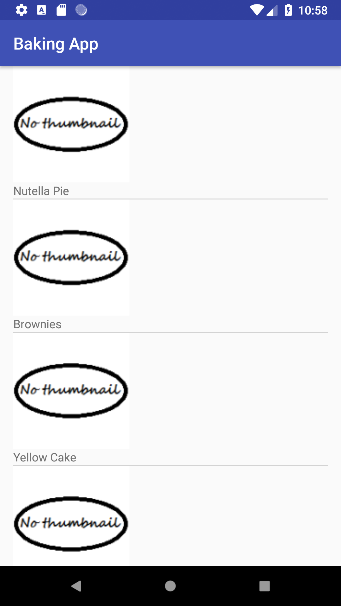

# BakingApp
Backing App is the 3rd project of Udacity [Android Developer Nanodegree Program](https://www.udacity.com/course/android-developer-nanodegree-by-google--nd801).

## Project Overview
Baking app allows a user to select a recipe and see video-guided steps for how to complete it.

In this project programmer learns how to use simple Exoplayer to display videos, handle error cases, add widgets to app, design responsive
app using Master/Detail architecture and using several libraries.

One of the biggest problems in learning process is to have a simple example to learn, therefore, it is tried to keep the project as simple as possible.

## Third-party libraries
* [Retrofit 2](https://github.com/square/retrofit)
* [ButterKnife](https://github.com/JakeWharton/butterknife)
* [Gson](https://github.com/google/gson)
* [ExoPlayer](https://github.com/google/ExoPlayer)
* [Picasso](https://github.com/square/picasso)

## Screenshots:

|    |   |   |   |
| ------------- | ------------- | ------------- | ------------- |
|  |   |  |  |

